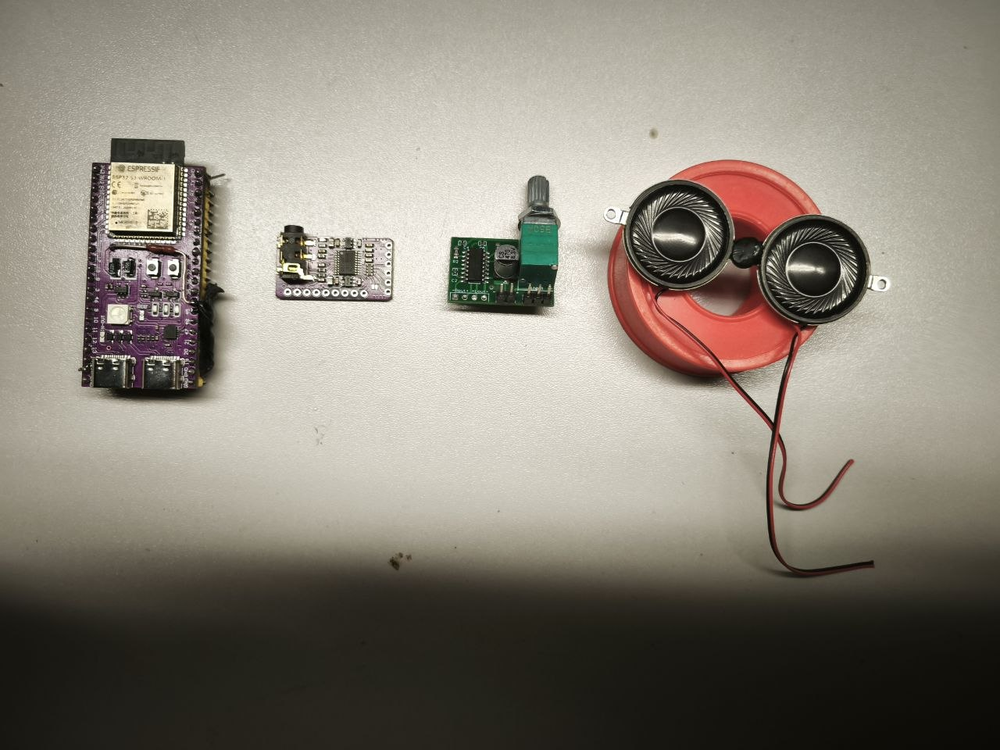

# Аудиовыход ESP32-S3: PCM5102A + PAM8403

## Принятый тракт



`ESP32-S3 -> I2S -> PCM5102A -> стерео line out -> PAM8403 -> 2 динамика`

Это подходящий окончательный тракт для текущего робота: PCM5102A даёт
качественный стереосигнал, PAM8403 работает от 5 В и обеспечивает примерно
2.5 Вт на канал при 1% THD с нагрузкой 4 Ом. Менять модули перед сборкой не
требуется.

Фото модулей:

- [PCM5102A, сторона компонентов](pcm5102a-dac-component-side.jpg);
- [PAM8403, сторона компонентов](pam8403-amplifier-component-side.jpg);
- [расположение контактов с обратной стороны](audio-chain-rear-view.jpg).

PDF:

- [схема установленного модуля PCM5102A](PCM5102A_MODULE_SCHEMATIC_REFERENCE.pdf);
- [официальный datasheet PCM5102A](PCM5102A_DATASHEET_TI.pdf);
- [официальный datasheet PAM8403](PAM8403_DATASHEET_DIODES.pdf);
- [официальная reference-плата PAM8403](PAM8403_EVB_USER_GUIDE_DIODES.pdf).

Схема PCM5102A соответствует распространённой фиолетовой плате с `H1L...H4L`.
Для зелёной платы PAM8403 изготовитель не указан, поэтому приложены официальная
схема включения микросхемы и схема близкой reference-платы, а не выдуманная
«родная» схема модуля.

## Схема соединений

Прошивка уже формирует Philips I2S, stereo S16LE, 44.1 кГц на I2S1.

| ESP32-S3 | Через | PCM5102A |
|---|---|---|
| GPIO5 | напрямую | `BCK` |
| GPIO6 | напрямую | `LCK` / `LRCK` |
| GPIO7 | напрямую | `DIN` |
| GPIO4 | напрямую к внешнему контакту `XSMT` | аппаратный soft mute |
| GND | напрямую | `GND` |
| общие 5 В робота | отдельной парой проводов | `VIN` |

`SCK` от S3 не нужен. PCM5102A работает в трёхпроводном режиме от PLL по BCK.
Контакт `SCK` DAC должен быть постоянно соединён с `GND`.

GPIO4/5/6/7 в этой прошивке зарезервированы только под аудиовыход. Они не
являются загрузочными strap-пинами ESP32-S3, не используются USB и не
перекрываются остальными компонентами проекта. При проводах I2S короче 10 см
последовательные резисторы не ставить. Места под 22–33 Ом нужны только как
ремонтный вариант, если на длинных проводах осциллограф покажет звон фронтов.

Аналоговая часть:

| PCM5102A | PAM8403 |
|---|---|
| `OUTL` / левый контакт line out | напрямую -> `L IN` |
| `OUTR` / правый контакт line out | напрямую -> `R IN` |
| `AGND` / земля line out | `GND IN` |

Предпочтительно паяться к площадкам `OUTL`, `OUTR`, `AGND`, а не использовать
штекер 3.5 мм. Отдельный делитель не нужен: регулятор на модуле PAM8403 уже
ослабляет входной сигнал. Первый запуск делать с ручкой в минимуме и ограничить
цифровую громкость прошивкой.

PCM5102A имеет ground-centered выход и по datasheet не требует разделительных
конденсаторов. Конденсатор «для чистоты» в разрыв звук не очищает. На модуле
PAM8403 входные конденсаторы уже установлены; второй комплект не добавлять.
`AGND` соединить обязательно: вход PAM8403 не дифференциальный, без общей
сигнальной земли уровни каналов не определены.

## Перемычки PCM5102A

`H1L...H4L` — это четыре трёхплощадочные перемычки, а не сигналы I2S. Средняя
площадка идёт к соответствующему входу PCM5102A, край `H` — к 3.3 В, край `L` —
к GND. Четыре внешних контакта `FLT`, `DEMP`, `XSMT`, `FMT` подключены к тем же
средним точкам и нужны только для внешнего управления.

Перед пайкой прозвонить фактическое положение 0-омных резисторов. Никогда не
замыкать одновременно стороны `H` и `L` и не управлять внешним контактом, пока
его перемычка соединена с `H` или `L`.

| Перемычка | Состояние | Назначение |
|---|---|---|
| `SCK` | `L` / GND | внутренний PLL, внешний MCLK отсутствует |
| `H1L`, `FLT` | `L` | normal-latency filter; лучшее подавление вне полосы |
| `H2L`, `DEMP` | `L` | de-emphasis выключен |
| `H3L`, `XSMT` | разомкнута; `XSMT` управляет GPIO4 | soft mute из прошивки |
| `H4L`, `FMT` | `L` | формат Philips I2S |

На `XSMT` поставить 100 кОм к GND: до старта прошивки DAC гарантированно
заглушён. Прошивка поднимает GPIO4 только при воспроизведении. Входы PAM8403 и
выходы PCM5102A на землю не шунтировать: это нагружает DAC и создаёт щелчки.
`XSMT` даёт штатный плавный mute. Сам PAM8403 остаётся запитанным; для полного
отключения питания позже нужен его `SHDN` либо отдельный load switch, а не
короткое замыкание аудиосигнала.

## Питание и фильтрация

Не питать усилитель через вывод 3V3 или стабилизатор платы ESP32-S3. Использовать
те же стабилизированные 5.0 В, которые приходят на S3, если источник и разъём
держат не менее 2 А. Ветку на PAM8403 брать до платы S3 отдельной парой проводов,
а не пропускать ток динамиков через её дорожки. Сделать звезду у входа 5 В:

```text
                    +--> ESP32-S3 5V
5V, >= 2 A ---------+--> PCM5102A VIN
                    +--> PAM8403 VCC
GND ----------------+--> отдельные возвраты S3, DAC и PAM
```

Возле питания PCM5102A установить 10 мкФ + 100 нФ X7R. На PAM8403 уже стоит
470 мкФ; дополнительно припаять 1 мкФ X7R и 100 нФ непосредственно между
`VCC` и `GND`. Если провода питания длиннее 15 см или на 5 В видны провалы от
двигателей, добавить у усилителя ещё 470–1000 мкФ, 6.3 В или выше.

## Динамики и выход класса D

Каждый динамик подключается только между своей парой выходов:

```text
PAM L+ ---- левый динамик ---- PAM L-
PAM R+ ---- правый динамик --- PAM R-
```

`L-` и `R-` не являются землёй. Их нельзя соединять между собой, с GND,
корпусом, экраном или землёй осциллографа. Оба динамика подключить синфазно:
красный провод к `+`, чёрный к `-`.

До включения измерить сопротивление динамиков:

- примерно 3–4 Ом постоянному току — динамик номиналом 4 Ом;
- примерно 6–8 Ом — динамик номиналом 8 Ом;
- меньше 3 Ом — к PAM8403 не подключать.

Для проводов до 15–20 см выходной LC-фильтр не нужен. Скрутить `L+` с `L-` и
отдельно `R+` с `R-`. Если провода проходят рядом с микрофонами или дают EMI,
поставить по одной ферритовой бусине 120–600 Ом на 100 МГц, не менее 1 А, в
каждый из четырёх выходных проводов непосредственно возле PAM8403. Не
добавлять случайные конденсаторы с выходов на GND.

## Прокладка и механика

- I2S держать короче 10 см; лучший порядок жил:
  `GND-BCK-GND-LCK-GND-DIN`.
- Аналоговый участок DAC -> PAM держать короче 5 см и вдали от антенны,
  DC/DC, двигателей и выходов класса D.
- Силовые провода динамиков и их петли не вести под DAC и будущей платой
  микрофонов.
- PAM8403 и динамики разнести от микрофонов максимально возможно.
- Закрепить регулятор громкости и после настройки отметить положение; не
  оставлять его на максимуме при первом включении.
- Динамикам нужен жёсткий корпус и отдельный задний объём; не крепить их к
  одной гибкой панели с микрофонами.

## Первый запуск

1. Проверить отсутствие КЗ между 5 В и GND и между всеми четырьмя выходами.
2. Включить S3 и PCM5102A без PAM8403, проверить наличие BCK/LCK/DIN.
3. Поставить регулятор PAM8403 в минимум и подключить один динамик.
4. Подать тестовый тон с цифровой громкостью не выше 10%.
5. Медленно поднять громкость, убедиться в отсутствии хрипа и нагрева.
6. Подключить второй динамик и повторить проверку.

Источники номиналов и режимов: официальный
[PCM5102A datasheet](https://www.ti.com/lit/ds/symlink/pcm5102a.pdf) и
[PAM8403 datasheet](https://www.diodes.com/datasheet/download/PAM8403.pdf).
